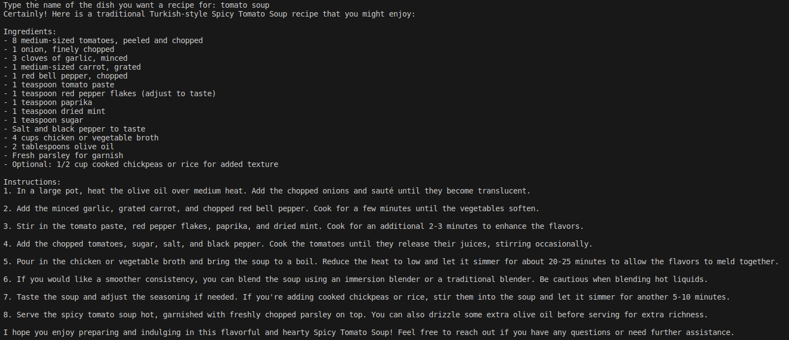
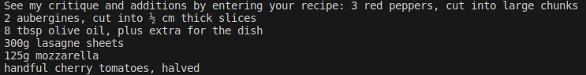
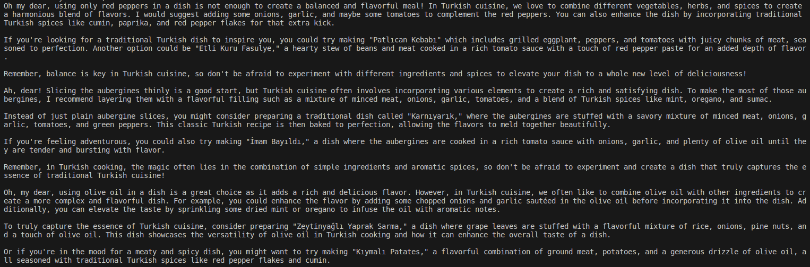

# AI Chef Experiment Results Report

## The test results for the Old Turkish Female Chef are as follows.

- In the first scenario, I asked for tomato soup as a meal.

- In the second scenario, I gave materials.

- In the third scenario, I gave Vegetarian lasagne recipe

As a result of my tests, I saw that:

When I name a dish, the chef gives me a detailed recipe. 
If I give him ingredients, she suggests a suitable dish. 
If I give him a recipe, she gives me criticisms and additions appropriate to his own structure.